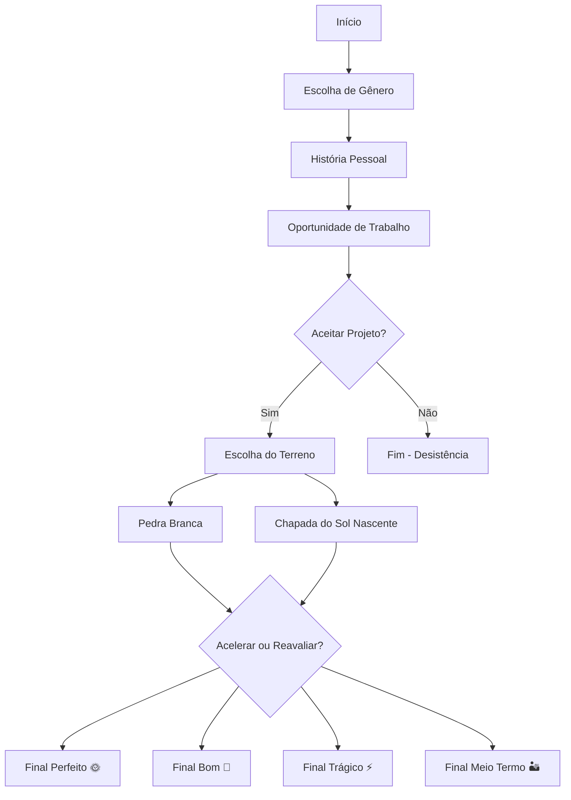

# 🌞 Solar Quest - Jogo Educativo Interativo

<div align="center">
  
  
  
  **Um jogo interativo sobre energia sustentável e impacto ambiental no sertão nordestino**
  
  [](https://SEU-USUARIO.github.io/solar-quest)
  [](LICENSE)
  [](https://reactjs.org/)
  [](https://tailwindcss.com/)
  
  ### [🎮 JOGAR AGORA](https://solar-quest.vercel.app)
  
</div>

---

## 📖 Sobre o Projeto

**Solar Quest** é um jogo educativo interativo desenvolvido como ferramenta pedagógica para conscientização sobre energia renovável, sustentabilidade e os desafios socioambientais do sertão nordestino brasileiro.

O jogo apresenta uma narrativa ramificada onde o jogador toma decisões críticas sobre a implementação de projetos de energia solar, explorando temas como:

- 🌱 **Sustentabilidade ambiental**
- 🏘️ **Impacto social em comunidades rurais**
- ⚖️ **Ética empresarial e responsabilidade**
- 🔄 **Consequências de decisões técnicas**
- 💡 **Educação sobre energia renovável**

---

## 🎯 Objetivos Educacionais

### 🎓 **Aprendizado**
- Compreender os desafios da implementação de energia solar
- Analisar impactos ambientais de projetos energéticos
- Desenvolver pensamento crítico sobre sustentabilidade
- Conhecer a realidade do sertão nordestino

### 🎮 **Mecânicas do Jogo**
- **Narrativa Interativa**: História com múltiplas ramificações
- **Sistema de Escolhas**: Decisões que impactam o desfecho
- **Múltiplos Finais**: 4 finais diferentes baseados nas escolhas
- **Progressão Salva**: Continue de onde parou
- **Experiência Imersiva**: Animações e design solarpunk

---

## 🕹️ Como Jogar

### 🚀 **Acesso Online**
1. **Visite**: [https://SEU-USUARIO.github.io/solar-quest](https://SEU-USUARIO.github.io/solar-quest)
2. **Digite seu nome** para personalizar a experiência
3. **Escolha seu gênero** para definir a narrativa inicial
4. **Tome decisões** que moldarão sua jornada
5. **Descubra** um dos múltiplos finais baseados em suas escolhas

### 📊 **Estrutura Narrativa**


---

## 🛠️ Tecnologias Utilizadas

### 🔧 **Frontend**
- **React.js 18+** - Framework principal
- **JavaScript ES6+** - Linguagem de programação
- **HTML5 & CSS3** - Estrutura e estilização

### 🎨 **Design & UI/UX**
- **Tailwind CSS** - Framework de estilização
- **Framer Motion** - Animações e transições
- **Lucide React** - Biblioteca de ícones
- **Design Solarpunk** - Estética sustentável minimalista

### ⚙️ **Funcionalidades**
- **Local Storage API** - Salvamento de progresso
- **Responsive Design** - Compatibilidade mobile/desktop
- **PWA Ready** - Experiência app-like
- **Accessibility** - Contraste e navegação otimizados

### 🚀 **Deploy & Hosting**
- **GitHub Pages** - Hospedagem gratuita
- **GitHub Actions** - CI/CD automático
- **Vite/Create React App** - Bundling e otimização

---

## 📁 Estrutura do Projeto

```
solar-quest/
├── 📂 public/
│   ├── 📄 index.html          # Template HTML
│   └── 🖼️ favicon.ico         # Ícone da aba
├── 📂 src/
│   ├── 📄 App.js              # Componente principal do jogo
│   ├── 📄 index.js            # Entry point React
│   └── 📄 index.css           # Estilos globais
├── 📂 .github/workflows/
│   └── 📄 deploy.yml          # Configuração do deploy
├── 📄 package.json            # Dependências do projeto
├── 📄 README.md              # Documentação
└── 📄 LICENSE                # Licença do projeto
```

---

## 🎭 Personagens e Cenários

### 👤 **Protagonistas**
- **Personagem Masculino**: Técnico em energia, filho do sertão
- **Personagem Feminino**: Engenheira ambiental, defensora da comunidade

### 🏞️ **Cenários**
- **Pedra Branca (PE)**: Terreno árido com alto potencial solar
- **Chapada do Sol Nascente (DF)**: Área elevada com riscos geológicos

### 👥 **NPCs Importantes**
- **Dona Lúcia**: Representante comunitária de Pedra Branca
- **Jeferson Silva**: Líder da comunidade Sol Nascente
- **Carla Fontes**: Investidora pragmática
- **Carlos Lima**: Representante da ONG Verde Viva
- **Ministro Elias Rocha**: Político local
- **Mãe Zefa / Dona Iraci**: Cartomantes que leem a terra

---

## 🎯 Finais Possíveis

| Final | Condição | Resultado |
|-------|----------|-----------|
| 🌞 **Perfeito** | Reavaliou o impacto e ouviu a comunidade | Projeto modelo internacional |
| 🌱 **Bom** | Acelerou mas reverteu após cartomante | Reconstrução sustentável |
| ⚡ **Trágico** | Acelerou e ignorou avisos | Desastre ambiental |
| 🏜️ **Meio Termo** | Abandonou após problemas | Desativação e recuperação lenta |

---

## 🚀 Instalação e Desenvolvimento

### 📋 **Pré-requisitos**
- Node.js 16+ 
- NPM ou Yarn
- Git

### 🔧 **Instalação Local**
```bash
# Clone o repositório
git clone https://github.com/SEU-USUARIO/solar-quest.git

# Entre na pasta
cd solar-quest

# Instale dependências
npm install

# Execute em desenvolvimento
npm start

# Acesse http://localhost:3000
```

### 🏗️ **Build de Produção**
```bash
# Gerar build otimizado
npm run build

# Testar build localmente
npx serve -s build
```

---

## 🤝 Contribuições

### 📌 **Como Contribuir**
1. 🍴 **Fork** o projeto
2. 🌿 **Crie uma branch** (`git checkout -b feature/nova-funcionalidade`)
3. 💾 **Commit** suas mudanças (`git commit -m 'Adiciona nova funcionalidade'`)
4. 📤 **Push** para a branch (`git push origin feature/nova-funcionalidade`)
5. 🔄 **Abra um Pull Request**

### 🐛 **Reportar Bugs**
- Use as [Issues do GitHub](https://github.com/SEU-USUARIO/solar-quest/issues)
- Descreva o problema detalhadamente
- Inclua steps para reproduzir
- Adicione screenshots se necessário

### 💡 **Sugerir Melhorias**
- Novas funcionalidades
- Melhorias de UX/UI  
- Otimizações de performance
- Correções de acessibilidade

---

## 👥 Equipe de Desenvolvimento

<table>
  <tr>
    <td align="center">
      <strong>🎓 Professor Orientador</strong><br>
      <strong>Renato Nunes Ramalho</strong><br>
      <em>Orientação acadêmica</em>
    </td>
  </tr>
</table>

<table>
  <tr>
    <td align="center">
      <strong>👨‍🎓 Alunos 3º ano "G"- EREMWAL</strong><br>
      <strong>Lucas Nadson</strong><br>
      <strong>Mariana Vitória</strong><br>
      <strong>Rikelmy</strong><br>
      <em>Desenvolvimento e pesquisa</em>
    </td>
  </tr>
</table>

<table>
  <tr>
    <td align="center">
      <strong>👨‍💻 Colaboradores</strong><br>
      <strong>Cefras Mandú</strong><br>
      <strong>Robson Luan</strong><br>
      <em>Eng. de Computação IFPB</em><br>
      <strong>Francisco Ferreira</strong><br>
      <em>Sistema de Informação UNIFAP-CE</em><br>
      <em>Desenvolvimento técnico</em>
    </td>
  </tr>
</table>

---

## 📊 Status do Projeto

- ✅ **Narrativa completa** implementada
- ✅ **Sistema de escolhas** funcionando
- ✅ **Múltiplos finais** disponíveis
- ✅ **Save/Load** automático
- ✅ **Design responsivo** mobile/desktop
- ✅ **Animações** e transições
- ✅ **Deploy automatizado** GitHub Pages

### 🔮 **Próximas Funcionalidades**
- 🔊 Trilha sonora ambiente
- 🖼️ Ilustrações customizadas dos cenários
- 📈 Sistema de estatísticas de jogadas
- 🌐 Suporte a múltiplos idiomas
- 📱 Versão PWA offline

---

## 📄 Licença

Este projeto está licenciado sob a **MIT License** - veja o arquivo [LICENSE](LICENSE) para detalhes.

```
MIT License - Uso educacional e não comercial incentivado
Copyright (c) 2024 Equipe Solar Quest EREMWAL
```

---

## 🌐 Links Úteis

- 🎮 **Jogo Online**: [https://solar-quest.vercel.app](https://solar-quest.vercel.app)
- 📊 **Repositório**: [https://github.com/SEU-USUARIO/solar-quest](https://github.com/SEU-USUARIO/solar-quest)
- 🚀 **Deploy Status**: [GitHub Actions](https://github.com/SEU-USUARIO/solar-quest/actions)
- 📝 **Issues**: [Reportar Problemas](https://github.com/SEU-USUARIO/solar-quest/issues)
- 💬 **Discussões**: [GitHub Discussions](https://github.com/SEU-USUARIO/solar-quest/discussions)

---

## 📞 Contato

Para dúvidas acadêmicas ou colaborações:

- 📧 **Email institucional**: [contato@eremwal.edu.br](mailto:contato@eremwal.edu.br)
- 🏫 **EREMWAL** - Escola de Referência em Ensino Médio
- 🎓 **IFPB** - Instituto Federal da Paraíba

---

<div align="center">
  
  ### 🌱 Feito com 💚 pela equipe EREMWAL
  
  **"Construir um futuro exige mais do que luz, exige consciência."**
  
  *- Solar Quest*
  
  ---
  
  ⭐ **Gostou do projeto? Deixe uma estrela!** ⭐
  
</div>
